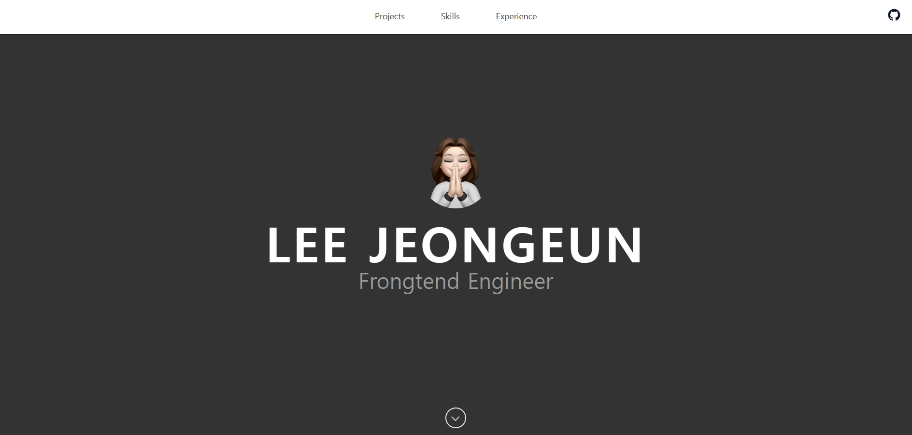

# 🚀 Frontend Portfolio

 <!-- 배포 후 스크린샷 추가 -->

## 📌 프로젝트 소개

이 프로젝트는 React와 Javascript, Tailwind CSS를 활용하여 제작한 개인 포트폴리오 웹사이트입니다.

## 🔗 배포 링크

[포트폴리오 사이트 보기](https://frontend-leejeongeun.github.io)

---

## 🛠 사용 기술

- **프레임워크**: React
- **라이브러리**: React Router, react-markdown, remark-gfm
- **스타일링**: Tailwind css, github-markdown-css
- **배포**: GitHub Pages

---

## 📂 프로젝트 구조

```plaintext
📦 my-portfolio
├── 📂 public           # 정적 파일
├── 📂 src              # 소스 코드
│   ├── 📂 assets
│   │   ├── 📂css
│   │   ├── 📂images
│   ├── 📂 components  # 재사용 가능한 컴포넌트
│   │   ├── Header.jsx
│   │   ├── Footer.jsx
│   │   ├── Projects.jsx
│   │   ├── Experience.jsx
│   │   ├── Introduce.jsx
│   │   ├── Skills.jsx
│   ├── 📂 pages       # 페이지 컴포넌트
│   │   ├── Home.jsx
│   │   ├── Post.jsx
│   ├── App.jsx        # 라우팅 설정
│   ├── index.jsx      # 엔트리 포인트
├── .gitignore
├── tailwind.config.js # Tailwind 설정
├── postcss.config.js  # PostCSS 설정
├── package.json       # 프로젝트 설정 파일
├── README.md          # 프로젝트 설명서
```

---

## ⚙️ 설치 및 실행 방법

### 1. 저장소 클론

```sh
git clone https://github.com/frontend-leejeongeun/frontend-leejeongeun.github.io.git
cd frontend-leejeongeun.github.io
```

### 2. 패키지 설치

```sh
npm install
```

### 3. 로컬 서버 실행

```sh
npm start
```

---

## 🎨 주요 기능

- **반응형 디자인**: 모바일/데스크톱 대응
- **라우팅 시스템**: React Router로 페이지 이동 구현
- **프로젝트 소개**: 개인 프로젝트 및 개발 경험 정리
- **GitHub Pages 배포**: 정적 웹사이트 배포

---

## 📢 개선할 점 및 업데이트 예정

- 프로젝트 추가에 따른 추가 포스팅 업데이트 🔍

---
