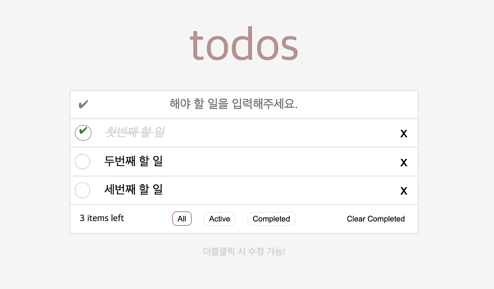

바닐라 자바스크립트를 이용해 todo-ist를 만들어 보았습니다.
투두리스트의 동작방식은 [TodoMVC](https://todomvc.com/examples/javascript-es6/dist/)와 같이 동작하도록 개발하였으며, 다음과 같은 형태입니다.

   {: .light .border .normal w='375' h='140' }

## 기능 정의하기
