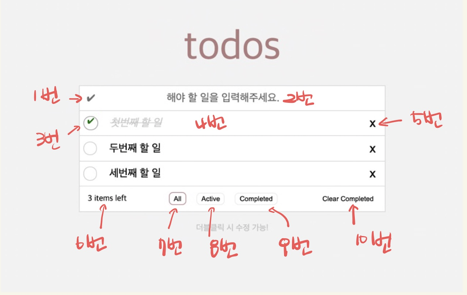

바닐라 자바스크립트를 이용해 todo-list를 만들어 보았습니다.
투두리스트의 동작방식은 [TodoMVC](https://todomvc.com/examples/javascript-es6/dist/)와 같이 동작하도록 개발하였으며, 다음과 같은 형태입니다.

   {: width="700" height="400" }

## 기능 정의하기
 {: width="700" height="400" }
 
 1. 전체 선택
   - Section전체 완료되지 않음 상태 일 때는 회색으로 표시
   - 전체 완료된 상태는 초록색으로 표시
   - 해당 버튼을 누르면 모든 할 일이 완료된 상태로 바뀜
   - 이미 모두 완료된 상태일 때, 누르면 전체 할 일 리스트가 완료되지 않은 상태로 변함

 2. 할 일 입력 
   - 사용자로부터 입력을 받음
   - Enter Key를 누르면 할 일이 추가됨
   - 할 일이 추가된 이후, 입력창의 value를 초기화

 3. 체크박스
   - 완료된 일이면, 체크표시
   - 해당 버튼을 누를 시, 할 일의 완료상태(isCompleted) 값을 토글 시킨다.

 4. 할 일 내용
   - 할 일 내용이 표시됨
   - 완료된 일이면 이태리체, 회색, 가운데선으로 표시
   - 마우스로 더블 클릭 시, 할 일 내용을 수정할 수 있음

 5. 할 일 삭제
   - 해당 할 일을 투두리스트에서 삭제함

 6. 완료되지 않은 할 일 개수 표시
   - 완료되지 않은 할 일(Active)의 개수를 표시한다.

 7. All 버튼
   - 투두리스트의 모든 할 일을 보여준다.

 8. Active 버튼
   - 투두리스트에서 아직 완료되지 않은 일을 보여준다.

 9. Clear Completed 버튼
   - 완료된 일을 투두리스트에서 삭제한다.

## HTML과 CSS 적용하기
먼저 [reset.css](https://meyerweb.com/eric/tools/css/reset/)를 적용해 주었습니다.
reset.css는 브라우저 간의 스타일 불일치를 해소하는 크로스브라우징을 목적으로 사용하는데 이는 기본적으로 설정되어있는 브라우저 스타일 설정이 개발하는데 불편을 주기 때문입니다. reset.css를 통해 이미 설정되어 있는 스타일을 적용하여 리셋 후 개발하였습니다. 

HTML과 CSS는 다음과 같이 적용하였습니다.

```html
<!DOCTYPE html>
<html lang="en">
  <head>
    <meta charset="UTF-8" />
    <meta http-equiv="X-UA-Compatible" content="IE=edge" />
    <meta name="viewport" content="width=device-width, initial-scale=1.0" />
    <title>TODO-VanilaJS</title>
    <link rel="stylesheet" href="reset.css" />
    <link rel="stylesheet" href="style.css" />
    <script defer="defer" src="todo.js"></script>
  </head>
  <body>
    <section class="todo-wrapper">
      <header class="todo-title">todos</header>
      <main class="todo-box">
        <div class="todo-input-box">
          <button class="complete-all-btn">✔</button>
          <input
            type="text"
            class="todo-input"
            placeholder="해야 할 일을 입력해주세요. Enter"
          />
        </div>
        <ul class="todo-list"></ul>
        <div class="todo-bottom">
          <div class="left-items"></div>
          <div class="button-group">
            <button class="show-all-btn selected" data-type="all">
              전체 할 일
            </button>
            <button class="show-active-btn" data-type="active">
              남은 할 일
            </button>
            <button class="show-completed-btn" data-type="completed">
              완료 된 할 일
            </button>
          </div>
          <button class="clear-completed-btn">완료 된 할 일 삭제</button>
        </div>
      </main>
      <footer class="info">더블클릭 시 수정 가능!</footer>
    </section>
  </body>
</html>
```
{: file='index.html'}

```css
/* http://meyerweb.com/eric/tools/css/reset/ 
   v2.0 | 20110126
   License: none (public domain)
*/

html,
body,
div,
span,
applet,
object,
iframe,
h1,
h2,
h3,
h4,
h5,
h6,
p,
blockquote,
pre,
a,
abbr,
acronym,
address,
big,
cite,
code,
del,
dfn,
em,
img,
ins,
kbd,
q,
s,
samp,
small,
strike,
strong,
sub,
sup,
tt,
var,
b,
u,
i,
center,
dl,
dt,
dd,
ol,
ul,
li,
fieldset,
form,
label,
legend,
table,
caption,
tbody,
tfoot,
thead,
tr,
th,
td,
article,
aside,
canvas,
details,
embed,
figure,
figcaption,
footer,
header,
hgroup,
menu,
nav,
output,
ruby,
section,
summary,
time,
mark,
audio,
video {
  margin: 0;
  padding: 0;
  border: 0;
  font-size: 100%;
  font: inherit;
  vertical-align: baseline;
}
/* HTML5 display-role reset for older browsers */
article,
aside,
details,
figcaption,
figure,
footer,
header,
hgroup,
menu,
nav,
section {
  display: block;
}
body {
  line-height: 1;
}
ol,
ul {
  list-style: none;
}
blockquote,
q {
  quotes: none;
}
blockquote:before,
blockquote:after,
q:before,
q:after {
  content: "";
  content: none;
}
table {
  border-collapse: collapse;
  border-spacing: 0;
}

```
{: file='reset.css'}

```css
html {
  height: 100%;
}

body {
  display: flex;
  flex-wrap: nowrap;
  justify-content: center;
  background-color: #f5f5f5;
  min-height: 100%;
}

.todo-wrapper {
  justify-content: center;
  margin-top: 3rem;
  min-width: 600px;
}

.todo-title {
  padding: 2rem;
  text-align: center;
  color: rosybrown;
  font-size: 5rem;
}

.todo-box {
  background-color: white;
  border: 1px solid #ddd;
}

.todo-input-box {
  display: flex;
  flex-wrap: nowrap;
  flex-direction: row;
  height: 3rem;
  border-bottom: 1px solid #ddd;
  justify-content: flex-start;
  align-items: center;
}

button {
  background-color: transparent;
  border: 0;
}

.complete-all-btn {
  color: gray;
  min-width: none;
  min-height: none;
  width: 1.5rem;
  height: 1.5rem;
  margin: 0.5rem 0.5rem;
  border-radius: 50px;
  cursor: pointer;
  font-size: 1.2rem;
}

.complete-all-btn.checked {
  color: green;
}

.todo-input {
  width: 80%;
  text-align: center;
  border: 0;
  outline: none;
  font-size: 1.3rem;
}

.todo-item {
  position: relative;
  display: flex;
  flex-wrap: nowrap;
  flex-direction: row;
  justify-content: space-between;
  align-items: center;
  height: 3rem;
  border-bottom: 1px solid #ddd;
}

.todo-item:hover .delBtn {
  opacity: 1;
}

.checkbox {
  min-width: none;
  min-height: none;
  width: 1.5rem;
  height: 1.5rem;
  margin: 0.5rem 0.5rem;
  border-radius: 50px;
  border: 1px solid lightgray;
  cursor: pointer;
  text-align: center;
}

.todo-item.checked .checkbox {
  border: 2px solid darkgray;
  color: green;
}

.todo {
  font-size: 1.3rem;
  padding: 0 1rem;
  width: 80%;
}

.todo-item.checked .todo {
  font-style: italic;
  text-decoration: line-through;
  color: lightgray;
}

.delBtn {
  opacity: 1;
  width: 3rem;
  height: 3rem;
  font-size: 1.5rem;
  font-weight: lighter;
  cursor: pointer;
}

.todo-bottom {
  height: 3rem;
  display: flex;
  flex-wrap: nowrap;
  flex-direction: row;
  justify-content: space-between;
  align-items: center;
  padding: 0 1rem;
}

.button-group {
  flex-direction: row;
  flex-wrap: nowrap;
}

.button-group button {
  border: 1px solid #eee;
  padding: 0.2rem 0.5rem;
  margin: 0 0.5rem;
  border-radius: 8px;
  cursor: pointer;
}

.button-group button.selected {
  border: 2px solid rosybrown;
  padding: 0.2rem 0.5rem;
  margin: 0 0.5rem;
  border-radius: 8px;
}

.clear-completed-btn:hover {
  font-style: italic;
  text-decoration: underline;
  cursor: pointer;
}

.edit-input {
  position: absolute;
  left: 0;
  top: 0;
  width: 590px;
  height: 2.8rem;
  margin: 0;
}

.info {
  margin-top: 1.5rem;
  text-align: center;
  color: #ccc;
}
```
{: file='style.css'}

## 할 일 추가하기
 1. 사용자 입력에 대한 이벤트 리스너 등록하기
   - 일단 할 일을 추가하기 위해서는 input 요소로부터 이벤트 리스너를 등록하여 이벤트를 캐치 후 입력받은 데이터를 배열에 순차적으로 담아주고 input은 초기화합니다.

```js
const todoInputEl = document.querySelector('.todo-input');

let todos = [];
let id = 0;

const init = () => {
    todoInputEl.addEventListener('keypress', (e) =>{
        if( e.key === 'Enter' ){
            appendTodos(e.target.value); 
            todoInputEl.value ='';
        }
    })
}
init()
```
{: file='todo.js'}

todo.js 파일을 만들어 줍니다. 그리고 input요소를 가져오기 위해 querySelector를 사용하여 todoInputEl에 담아두었습니다. todos는 할 일들을 담을 배열입니다. id는 각각의 할 일들을 고유하게 구별할 수 있는 키값을 설정하기 위해 선언하였습니다.  init()함수는 todos.js파일이 실행되자마자 호출되는 함수입니다.
init() 함수는 input요소를 담은 todoInputEl에 'keypress'에 대한 이벤트 리스너를 등록시킵니다. 만약 입력되는 값이 'Enter'라면 appendTodos() 함수에 e.target.value(input의 value)를 넘겨주고, todoInputEl의 value 값을 초기화합니다.

 2. 할 일 추가하기
   - todos 배열에 할 일을 추가하는 appendTodos()함수를 만들었습니다. 할 일은 다음과 같은 타입을 가집니다.
| Company        | Type        | Description            |
| :------------- | :---------- | ---------------------: |
| id             | number      | 할 일의 고유한 키 값    |
| isCompleted    | boolean     | 할 일의 완료 상태       |
| content        | string      | 할 일의 내용            |

```js
let todos = []
let id= 0;

const setTodos = (newTodos) => {
  todos = newTodos;
}

const getAllTodos = () => {
  return todos;
}

const appendTodos = (text) => {
  const newId = id++;
  const newTodos = getAllTodos().concat({id:newId, isCompleted:false, content:text})
  // 스프레드 연산자 사용할 경우
  // const newTodos = [...getAllTodos(), {id:newId, isCompleted:false, content:text}]
  setTodos(newTodos)
  paintTodos();
}
```
{: file='todo.js'}

newId 변수는 새롭게 저장되는 할 일의 id값이며, ++연상자를 통해 1씩 증가시킴으로써 id값이 중복되지 않도록 해줍니다. newTodos는 새롭게 저장될 todos 배열로 getAlltodos()함수를 통해 이전 todos 배열을 가져온 후, 새롭게 추가된 할 일을 concat()을 통해 newTodo에 저장합니다. concat()을 사용하는 이유는 concat()은 기존 todos배열에 아무런 영향을 주지 않고 todos배열을 복사한 값에 추가한 할일을 더해 반환해주기 때문입니다. 이렇게 반환 된 newTodos를 setTodos()라는 함수로 기존 todos 배열을 변경시켜줍니다.

concat()말고 다른 방법으로는 스트레드 연산자를 사용해서 위 소스 중 주석과 같이 선언할 수 있습니다.

 3. HTML에 추가된 할 일 그려주기
   - 할일이 추가될 때마다 paintTodos()함수를 실행하여 렌더링 하도록 할텐데 이 함수를 살펴봅니다. 

```js
const todoListEl =  document.querySelector('.todo-list');

const paintTodos = () => {
  todoListEl.innerHTML = ''; // todoListEl 요소 안의 HTML 초기화
  const allTodos = getAllTodos() //todos 배열 가져오기

  //"todo-item"에 해당하는 HTML을 그려서 "todo-list"에 추가하기
  allTodos.forEach(todo => { 
    const todoItemEl = document.createElement('li');
    todoItemEl.classList.add('todo-item');
    
    // todoItemElem.setAttribute('data-id', todo.id );
    const checkboxEl = document.createElement('div');
    checkboxEl.classList.add('checkbox');

    const todoEl = document.createElement('div');
    todoEl.classList.add('todo');
    todoEl.innerText = todo.content;

    const delBtnEl = document.createElement('button');
    delBtnEl.classList.add('delBtn');
    delBtnEl.innerHTML = 'X';

    if(todo.isCompleted) {
      todoItemEl.classList.add('checked');
      checkboxEl.innerText = '✔';
    }

    todoItemEl.appendChild(checkboxEl);
    todoItemEl.appendChild(todoEl);
    todoItemEl.appendChild(delBtnEl);

    todoListEl.appendChild(todoItemEl);
  })
}
```
{: file='todo.js'}