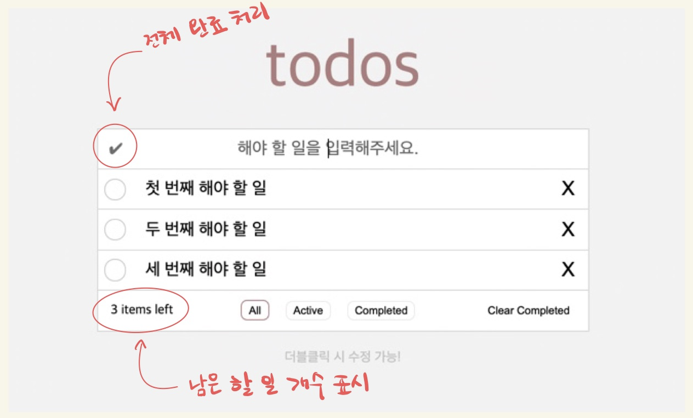

리액트를 사용해 todo-list를 만들어 보았습니다.
투두리스트의 동작방식은 [TodoMVC](https://todomvc.com/examples/javascript-es6/dist/)와 같이 동작하도록 개발하였으며, 다음과 같은 형태입니다. 기존의 바닐라 자바스크립트와 동일한 UI,기능을 유지하도록 의도하였으며 소스코드만 다르게 작성되었습니다. 이 과정을 통해 순수자바스크립트와 리액트 프레임워크 사용시 차이점과 장단점을 좀 더 직관적으로 체감할 수 있을 것으로 기대합니다.
이 리액트 앱의 전체 소스코드는 [TodosReact-github-jeongeun](https://github.com/frontend-leejeongeun/Project-Todos-React) 여기서 볼 수 있습니다.


## 기능 정의하기


1.  전체 선택

- Section전체 완료되지 않음 상태 일 때는 회색으로 표시
- 전체 완료된 상태는 초록색으로 표시
- 해당 버튼을 누르면 모든 할 일이 완료된 상태로 바뀐다
- 이미 모두 완료된 상태일 때, 누르면 전체 할 일 리스트가 완료되지 않은 상태로 변한다

2.  할 일 입력

- 사용자로부터 입력을 받는 인풋
- Enter Key를 누르면 할 일이 추가된다
- 할 일이 추가된 이후, 입력창의 value를 초기화

3.  체크박스

- 완료된 일이면, 체크표시
- 해당 버튼을 누를 시, 할 일의 완료상태(isCompleted) 값을 토글 시킨다.

4.  할 일 내용

- 할 일 내용이 표시된다
- 완료된 일이면 이태리체, 회색, 가운데선으로 표시
- 마우스로 더블 클릭 시, 할 일 내용을 수정할 수 있다

5.  할 일 삭제

- 해당 할 일을 투두리스트에서 삭제한다

6.  남은 할 일

- 완료되지 않은 할 일의 개수를 표시한다.

7.  전체 할 일 버튼

- 투두리스트의 모든 할 일을 보여준다.

8.  남은 할 일 버튼

- 투두리스트에서 아직 완료되지 않은 일을 보여준다.

9.  완료 된 할 일 버튼

- 완료된 일을 보여준다.

10. 완료 된 할 일 삭제 버튼

- 완료된 일을 투두리스트에서 삭제한다.

## HTML과 CSS 적용하기

먼저 [reset.css](https://meyerweb.com/eric/tools/css/reset/)를 index.css에 적용해 주었습니다. reset.css는 브라우저 간의 스타일 불일치를 해소하는 크로스브라우징을 목적으로 사용하는데 이는 기본적으로 설정되어있는 브라우저 스타일 설정이 개발하는데 불편을 주기 때문입니다. reset.css를 통해 이미 설정되어 있는 스타일을 적용하여 리셋 후 개발하였습니다.

HTML과 CSS는 다음과 같이 적용하였습니다.

```jsx
import "./App.css";
function App() {
  return (
    <section className="todo-wrapper">
      <header className="todo-title">todos</header>
      <main className="todo-box">
        <div className="todo-input-box">
          <button className="complete-all-btn">✔</button>
          <input
            type="text"
            className="todo-input"
            placeholder="해야 할 일을 입력해주세요. Enter"
          />
        </div>
        <ul className="todo-list"></ul>
        <div className="todo-bottom">
          <div className="left-items"></div>
          <div className="button-group">
            <button className="show-all-btn selected" data-type="all">
              전체 할 일
            </button>
            <button clasNames="show-active-btn" data-type="active">
              남은 할 일
            </button>
            <button className="show-completed-btn" data-type="completed">
              완료 된 할 일
            </button>
          </div>
          <button className="clear-completed-btn">완료 된 할 일 삭제</button>
        </div>
      </main>
      <footer className="info">더블클릭 시 수정 가능!</footer>
    </section>
  );
}

export default App;
```

```css
/* http://meyerweb.com/eric/tools/css/reset/ 
   v2.0 | 20110126
   License: none (public domain)
*/

html,
body,
div,
span,
applet,
object,
iframe,
h1,
h2,
h3,
h4,
h5,
h6,
p,
blockquote,
pre,
a,
abbr,
acronym,
address,
big,
cite,
code,
del,
dfn,
em,
img,
ins,
kbd,
q,
s,
samp,
small,
strike,
strong,
sub,
sup,
tt,
var,
b,
u,
i,
center,
dl,
dt,
dd,
ol,
ul,
li,
fieldset,
form,
label,
legend,
table,
caption,
tbody,
tfoot,
thead,
tr,
th,
td,
article,
aside,
canvas,
details,
embed,
figure,
figcaption,
footer,
header,
hgroup,
menu,
nav,
output,
ruby,
section,
summary,
time,
mark,
audio,
video {
  margin: 0;
  padding: 0;
  border: 0;
  font-size: 100%;
  font: inherit;
  vertical-align: baseline;
}
/* HTML5 display-role reset for older browsers */
article,
aside,
details,
figcaption,
figure,
footer,
header,
hgroup,
menu,
nav,
section {
  display: block;
}
body {
  line-height: 1;
}
ol,
ul {
  list-style: none;
}
blockquote,
q {
  quotes: none;
}
blockquote:before,
blockquote:after,
q:before,
q:after {
  content: "";
  content: none;
}
table {
  border-collapse: collapse;
  border-spacing: 0;
}
```

```css
html {
  height: 100%;
}

body {
  display: flex;
  flex-wrap: nowrap;
  justify-content: center;
  background-color: #f5f5f5;
  min-height: 100%;
}

.todo-wrapper {
  justify-content: center;
  margin-top: 3rem;
  min-width: 600px;
}

.todo-title {
  padding: 2rem;
  text-align: center;
  color: rosybrown;
  font-size: 5rem;
}

.todo-box {
  background-color: white;
  border: 1px solid #ddd;
}

.todo-input-box {
  display: flex;
  flex-wrap: nowrap;
  flex-direction: row;
  height: 3rem;
  border-bottom: 1px solid #ddd;
  justify-content: flex-start;
  align-items: center;
}

button {
  background-color: transparent;
  border: 0;
}

.complete-all-btn {
  color: gray;
  min-width: none;
  min-height: none;
  width: 1.5rem;
  height: 1.5rem;
  margin: 0.5rem 0.5rem;
  border-radius: 50px;
  cursor: pointer;
  font-size: 1.2rem;
}

.complete-all-btn.checked {
  color: green;
}

.todo-input {
  width: 80%;
  text-align: center;
  border: 0;
  outline: none;
  font-size: 1.3rem;
}

.todo-item {
  position: relative;
  display: flex;
  flex-wrap: nowrap;
  flex-direction: row;
  justify-content: space-between;
  align-items: center;
  height: 3rem;
  border-bottom: 1px solid #ddd;
}

.todo-item:hover .delBtn {
  opacity: 1;
}

.checkbox {
  min-width: none;
  min-height: none;
  width: 1.5rem;
  height: 1.5rem;
  margin: 0.5rem 0.5rem;
  border-radius: 50px;
  border: 1px solid lightgray;
  cursor: pointer;
  text-align: center;
}

.todo-item.checked .checkbox {
  border: 2px solid darkgray;
  color: green;
}

.todo {
  font-size: 1.3rem;
  padding: 0 1rem;
  width: 80%;
}

.todo-item.checked .todo {
  font-style: italic;
  text-decoration: line-through;
  color: lightgray;
}

.delBtn {
  opacity: 1;
  width: 3rem;
  height: 3rem;
  font-size: 1.5rem;
  font-weight: lighter;
  cursor: pointer;
}

.todo-bottom {
  height: 3rem;
  display: flex;
  flex-wrap: nowrap;
  flex-direction: row;
  justify-content: space-between;
  align-items: center;
  padding: 0 1rem;
}

.button-group {
  flex-direction: row;
  flex-wrap: nowrap;
}

.button-group button {
  border: 1px solid #eee;
  padding: 0.2rem 0.5rem;
  margin: 0 0.5rem;
  border-radius: 8px;
  cursor: pointer;
}

.button-group button.selected {
  border: 2px solid rosybrown;
  padding: 0.2rem 0.5rem;
  margin: 0 0.5rem;
  border-radius: 8px;
}

.clear-completed-btn:hover {
  font-style: italic;
  text-decoration: underline;
  cursor: pointer;
}

.edit-input {
  position: absolute;
  left: 0;
  top: 0;
  width: 590px;
  height: 2.8rem;
  margin: 0;
}

.info {
  margin-top: 1.5rem;
  text-align: center;
  color: #ccc;
}
```

## 할 일 추가하기

1.  사용자 입력에 대한 상태 관리 하기

- 순수 자바스크립트로 작성할 때에는 document.querySelector도 직접적인 DOM 조작을 하여 이벤트를 처리했는데 React에서는 상태 관리와 DOM을 React가 직접 처리하기 때문에, React의 방식에 맞게 코드를 수정했습니다. useState Hooks를 사용했는데 newTodo라는 상태를 만들어서 텍스트 입력 값을 관리하고 todos 상태는 할 일 목록을 관리합니다. 또한 input에 입력 필드의 변경을 감지하는 handleInputChange와 키가 눌렸을 때 handleKeyDown를 추가해주었습니다. (리액트에서는 onKeyPress는 Enter나 Backspace같은 특정 키를 감지하지 못할수 있어 권장되지 않는 이유로 onKeyDown을 사용했습니다.) 이들은 각각 newTodo 상태를 업데이트하도록 하고고 todos에 새로운 할 일을 추가하고 newTodo를 비울 수 있도록 했습니다.
  마지막으로 할일을 렌더링 하기기 위해 jsx 문법을 사용해서 todos.map으로 할 일 목록을 렌더링 하고 있습니다.

```jsx
import "./App.css";
import React, { useState } from "react";

function App() {
  const [todos, setTodos] = useState([]);
  const [newTodo, setNewTodo] = useState("");

  const handleInputChange = (e) => {
    setNewTodo(e.target.value); // 입력값을 상태로 저장
  };

  const handleKeyDown = (e) => {
    if (e.key === "Enter") {
      setTodos([
        ...todos,
        { id: Date.now(), content: newTodo, isCompleted: false },
      ]); // 새로운 Todo 추가
      setNewTodo(""); // 입력 필드 초기화
    }
  };

  return (
    <section className="todo-wrapper">
      <header className="todo-title">todos</header>
      <main className="todo-box">
        <div className="todo-input-box">
          <button className="complete-all-btn">✔</button>
          <input
            type="text"
            className="todo-input"
            placeholder="해야 할 일을 입력해주세요. Enter"
            value={newTodo} // 현재 입력값을 상태에서 관리
            onChange={handleInputChange} // 입력값 변화 감지
            onKeyDown={handleKeyDown} // Enter키 입력 감지
          />
        </div>
        <ul className="todo-list">
          {todos.map((todo) => (
            <li className="todo-item" key={todo.id}>
              <div className="checkbox"></div>
              <div className="todo">{todo.content}</div>
              <button className="delBtn">X</button>
            </li> // 할 일 목록을 렌더링
          ))}
        </ul>
        <div className="todo-bottom">
          <div className="left-items"></div>
          <div className="button-group">
            <button className="show-all-btn selected" data-type="all">
              전체 할 일
            </button>
            <button className="show-active-btn" data-type="active">
              남은 할 일
            </button>
            <button className="show-completed-btn" data-type="completed">
              완료 된 할 일
            </button>
          </div>
          <button className="clear-completed-btn">완료 된 할 일 삭제</button>
        </div>
      </main>
      <footer className="info">더블클릭 시 수정 가능!</footer>
    </section>
  );
}

export default App;
```

2.  할 일 추가하기

- todos 배열에 할 일을 추가하는 appendTodos()함수를 만들었습니다. 할 일은 다음과 같은 타입을 가집니다.

| Element     | Type    |
| :---------- | :------ |
| id          | number  |
| isCompleted | boolean |
| content     | string  |

```jsx
const [todos, setTodos] = useState([]);
const [newTodo, setNewTodo] = useState("");

const handleInputChange = (e) => {
  setNewTodo(e.target.value); // 입력값을 상태로 저장
};

const handleKeyDown = (e) => {
  if (e.key === "Enter") {
    setTodos([
      ...todos,
      { id: Date.now(), content: newTodo, isCompleted: false },
    ]); // 새로운 Todo 추가
    setNewTodo(""); // 입력 필드 초기화
  }
};
```

사용자가 입력 필드에 할 일을 작성하고 Enter 키를 누르면 handleKeyDown 함수가 호출됩니다.
id는 현재시간을 기준으로 추가되게 해주어 중복을 방지했습니다.
setTodos를 사용하여 새로운 할 일을 기존의 todos 배열에 추가한 후 setNewTodo에 빈값을 넣어주어 입력 필드를 비웁니다.
리액트는 상태 변경을 감지하고 컴포넌트를 자동으로 재렌더링하여 새로운 할 일이 화면에 표시됩니다.
이 과정을 통해 할 일 추가, 상태 관리, UI 업데이트가 이루어집니다.
바닐라 자바스크립트에서는 concat()을 사용해서 기존 배열을 변경하지 않고 새로운 배열을 반환했었는데 이번 리액트 앱에서는 스프레드 연산자를 사용했습니다. 구문이 더 간단하고, 배열뿐만 아니라 객체에도 사용할 수 있어 더 범용적이라는 생각이 들었습니다.

3.  HTML에 추가된 할 일 그려주기

- 순수 자바스크립트에서는 할일이 추가될 때마다 paintTodos()함수를 실행하여 렌더링 해주었는데 리액트에서는 jsx문법안에서 map으로 간단히 추가를 할 수가 있었습니다. 코드의 길이가 1/4이상 줄어드는것을 확인할 수 있었습니다.

```jsx
<ul className="todo-list">
  {todos.map((todo) => (
    <li className="todo-item" key={todo.id}>
      <div className="checkbox"></div>
      <div className="todo">{todo.content}</div>
      <button className="delBtn">X</button>
    </li> // 할 일 목록을 렌더링
  ))}
</ul>
```

## 할 일 목록에서 할 일 삭제

삭제버튼을 클릭했을때 handleDeleteTodo함수에 todo의 id를 전달해주고 handleDeleteTodo에서는 그 id를 가지고 setTodos를 filter메소드를 사용하여 클릭하지 않은 리스트만 담겨지도록 렌더링 해주었습니다. 기존에 순수 자바스크립트만을 사용할 때에는 paintTodos() 라는 함수로 html을 그려주었는데 이 부분의 로직이 꽤나 길고 복잡했었습니다. 그런데 리액트에서는 상태관리를 통해 돔을 직접적으로 제어하지 않아도 변화된 요소만 렌더링 해주기 때문에 로직과 소스코드가 매우 가볍고 간단해진 것을 알 수 있습니다.

```jsx
const handleDeleteTodo = (todoId) => {
  setTodos(todos.filter((todo) => todo.id !== todoId));
};
(...생략)

<ul className="todo-list">
  {todos.map((todo) => (
    <li className="todo-item" key={todo.id}>
      <div className="checkbox"></div>
      <div className="todo">{todo.content}</div>
      <button
        className="delBtn"
        onClick={() => handleDeleteTodo(todo.id)}
      >
        X
      </button>
    </li> // 할 일 목록을 렌더링
  ))}
</ul>
```

## 할 일 완료 처리

완료 처리도 삭제 기능과 마찬가지로 onClick 이벤트 리스너 등록을 통해 처리해주면 됩니다.

```js
const handleCheckTodo = (todoId) => {
    setTodos(
      todos.map((todo) =>
        todo.id === todoId ? { ...todo, isCompleted: !todo.isCompleted } : todo
      )
    );
  };
(...생략)

{todos.map((todo) => (
  <li
    className={`todo-item ${todo.isCompleted ? "checked" : ""}`}
    key={todo.id}
  >
    <div
      className="checkbox"
      onClick={() => handleCheckTodo(todo.id)}
    >
      {todo.isCompleted ? "✔" : ""}
    </div>
    <div className="todo">{todo.content}</div>
    <button
      className="delBtn"
      onClick={() => handleDeleteTodo(todo.id)}
    >
      X
    </button>
  </li> // 할 일 목록을 렌더링
))}
```

체크박스를 click하면 handleCheckTodo() 함수가 실행되며, 동작 방식은 삭제 기능과 거의 같습니다. 차이점은 삭제에서는 Array filter()를 사용해서 삭제하고자 하는 할 일을 제외한 배열을 만들었으면, 완료 처리는 Array map()을 사용하여 완료 처리를 하고자 하는 할 일의 isCompleted 값을 토글(true이면 false로, false면 true로) 처리하여 새로운 todos 배열을 저장합니다.

## 할 일 수정하기

1.  더블 클릭 시 수정 모드 전환

- 수정모드의 로직을 설명하자면 수정 모드에서 할 일을 수정하는 상태를 관리하는 newTodo를 추가합니다. 다음 수정할 항목을 선택했을 때 해당 항목의 내용을 newTodo 상태에 반영합니다. 마지막으로 Enter 키를 누르면 해당 newTodo 값을 todos 배열에 반영하여 수정합니다.

```jsx
const [editingId, setEditingId] = useState(null); // 수정 중인 todo의 ID
(...생략)

// 할 일 수정 (수정 모드로 전환)
const handleDoubleClick = (todoId, content) => {
  setEditingId(todoId); // 수정하려는 todo의 ID를 설정
  setNewTodo(content); // 해당 내용으로 입력창에 값을 설정
};

// 수정된 내용 저장
const handleUpdateTodo = (e, todoId) => {
  if (e.key === "Enter" && newTodo.trim() !== "") {
    setTodos(
      todos.map((todo) =>
        todo.id === todoId ? { ...todo, content: newTodo } : todo
      )
    );
    setNewTodo(""); // 입력창 초기화
    setEditingId(null); // 수정 모드 종료
  }
};
(...생략)

{/* 수정 모드일 경우 입력 필드로 전환 */}
{editingId === todo.id ? (
  <input
    className="edit-input"
    value={newTodo}
    onChange={handleInputChange}
    onKeyDown={(e) => handleUpdateTodo(e, todo.id)} // 수정된 내용 저장
    autoFocus
  />
) : (
  <div
    className="todo"
    onDoubleClick={() => handleDoubleClick(todo.id, todo.content)}
  >
    {todo.content}
  </div>
)}
```

handleDoubleClick 함수는 더블클릭 시, 해당 todo의 content를 newTodo로 설정하고, 수정할 todo의 id를 editingId로 설정하여 수정 모드로 전환합니다.
handleUpdateTodo 함수는 수정된 내용을 입력창에서 Enter 키를 누르면 todos 배열을 업데이트하여 해당 항목의 내용을 수정합니다.
마지막으로 수정된 항목은 newTodo 상태로 관리되며, 사용자가 Enter 키를 눌렀을 때 수정된 내용으로 업데이트됩니다.

## 전체 완료 처리, 남은 할 일 개수, 하단 필터링 버튼 기능 구현

{: width="700" height="400" }

##

투두리스트 상단의 전체 완료 처리와 하단의 필터 기능을 구현하겠습니다.

1.  todos 전체 완료 처리

- 전체 완료 처리 기능은 complete-all-btn 버튼 클릭 시 모든 할 일을 완료/미완료 상태로 바꾸는 기능으로 버튼을 클릭했을 때 todos 배열에 있는 모든 항목의 isCompleted 값을 반전시키는 로직입니다.

```jsx
// 전체 완료 처리
const handleCompleteAll = () => {
  const allCompleted = todos.every((todo) => todo.isCompleted);
  setTodos(todos.map((todo) => ({ ...todo, isCompleted: !allCompleted })));
};
```

2.  남은 할 일 개수 표시

- 남은 할 일 개수는 완료되지 않은 할 일의 수를 계산하여 표시합니다. getLeftItemsCount 함수는 완료되지 않은 할 일의 개수를 계산하여 반환합니다. 이 값을 렌더링할 때 left-items 요소에 표시합니다.

```jsx
// 남은 할 일 개수
const getLeftItemsCount = () =>
  todos.filter((todo) => !todo.isCompleted).length;
```

3.  필터링 기능 (전체, 남은, 완료 된 할 일)

- 사용자가 필터 버튼을 클릭했을 때, 각각의 조건에 맞는 할 일만 보여주는 기능입니다. currentShowType 상태를 사용하여 어떤 필터를 적용할지 결정합니다.

```jsx
// 필터 버튼 클릭 시 호출
const handleShowTodosType = (type) => {
  setCurrentShowType(type);
};

// 현재 필터 타입에 맞춰 할 일 렌더링
const filteredTodos = todos.filter((todo) => {
  switch (currentShowType) {
    case "active":
      return !todo.isCompleted;
    case "completed":
      return todo.isCompleted;
    default:
      return true;
  }
});
```

4.  완료된 할 일 삭제

- clear-completed-btn 버튼 클릭 시 완료된 할 일을 모두 삭제하는 기능입니다.

```jsx
// 완료된 할 일 삭제
const handleClearCompletedTodos = () => {
  setTodos(todos.filter((todo) => !todo.isCompleted));
};
```

## 리팩토링

기능적인 부분을 완료 후 리액트에 맞게 리팩토링을 진행했습니다.

1.  비동기 상태 업데이트 최적화 (prevTodos 활용)

- 기존에는 setTodos([...todos, newTodo]) 형식으로 상태를 업데이트하였으나, 비동기 특성을 고려하여 prevTodos를 사용하도록 변경했습니다.

```jsx
const addTodo = (content) => {
  setTodos((prevTodos) => [
    ...prevTodos,
    { id: Date.now(), content, isCompleted: false },
  ]);
};
```

2.  모든 할 일 완료/해제 시 prevTodos 적용

- 모든 할 일의 완료 상태를 변경하는 함수에서 prevTodos를 사용하여 비동기 업데이트 문제를 해결했습니다.

```jsx
const handleCompleteAll = () => {
  setTodos((prevTodos) => {
    const allCompleted = prevTodos.every((todo) => todo.isCompleted);
    return prevTodos.map((todo) => ({ ...todo, isCompleted: !allCompleted }));
  });
};
```

3.  useMemo 활용하여 불필요한 연산 줄이기

- 필터링된 목록을 매번 계산하는 대신, useMemo를 사용하여 필요할 때만 연산되도록 변경했습니다

```jsx
const filteredTodos = useMemo(() => {
  return todos.filter((todo) => {
    switch (currentShowType) {
      case "active":
        return !todo.isCompleted;
      case "completed":
        return todo.isCompleted;
      default:
        return true;
    }
  });
}, [todos, currentShowType]);
```

4.  불필요한 함수 재생성 방지 (useCallback 적용)

- 핸들러 함수들을 useCallback을 사용하여 메모이제이션 처리하였습니다.

```jsx
const handleDeleteTodo = useCallback((todoId) => {
  setTodos((prevTodos) => prevTodos.filter((todo) => todo.id !== todoId));
}, []);
```

| 비교 항목   | 바닐라 자바스크립트                                             | 리액트                                        |
| ----------- | --------------------------------------------------------------- | --------------------------------------------- |
| 상태 관리   | document.querySelector, addEventListener 활용하여 직접 DOM 조작 | useState, setState로 효율적으로 관리          |
| 렌더링 방식 | 변경된 요소만 직접 업데이트해야 함                              | 상태 변화에 따라 자동 렌더링                  |
| 코드 구조   | 이벤트 리스너와 DOM 조작 코드가 섞여 있어 복잡해질 수 있음      | 컴포넌트 기반으로 유지보수가 용이             |
| 성능 최적화 | 직접 최적화 필요                                                | useMemo, useCallback 등 내장 최적화 기능 제공 |
| 재사용성    | 같은 기능이라도 반복 구현 필요                                  | 컴포넌트로 분리하여 재사용 가능               |

리액트로 작업하면서 느낀점은

1.  리액트의 상태 관리는 확실히 편리하다는 점입니다. useState 하나로 DOM을 직접 조작하는 과정 없이 깔끔하게 상태 변경이 가능한 것이 편리했습니다.

2.  useMemo, useCallback 등을 활용하면 렌더링 성능을 최적화할 수 있고 이를 활용하여 불필요한 연산과 렌더링을 줄일 수 있었다는 점 입니다.

3.  바닐라 자바스크립트는 이벤트 핸들러를 직접 관리하면서 DOM을 조작해야 했고 소스가 다소 복잡하고 지저분해 보였지만, 리액트는 컴포넌트 기반으로 코드가 깔끔하게 유지되었다는 점입니다.

4.  다만 단점으로는 리액트는 처음 배우기 어렵다는 점이 있었습니다. 바닐라 자바스크립트에서는 단순한 querySelector나 addEventListener로 가능했던 작업도, 리액트에서는 useState, useEffect, useMemo 등을 학습하고 고려해야 해서 학습 난이도가 있다는 점을 느꼈습니다.

이번 프로젝트를 통해 바닐라 자바스크립트와 리액트의 차이를 체감할 수 있었고, 리액트의 컴포넌트 기반 아키텍처와 상태 관리의 강력함을 다시금 느낄 수 있었다. 또한 습관적으로 쓰던 hook들에 대해 다시 한번 생각할 수 있게되어 좋은 과정이 되었습니다.

전체 소스코드는 [TodosReact-github-jeongeun](https://github.com/frontend-leejeongeun/Project-Todos-React) 여기서 볼 수 있습니다.
